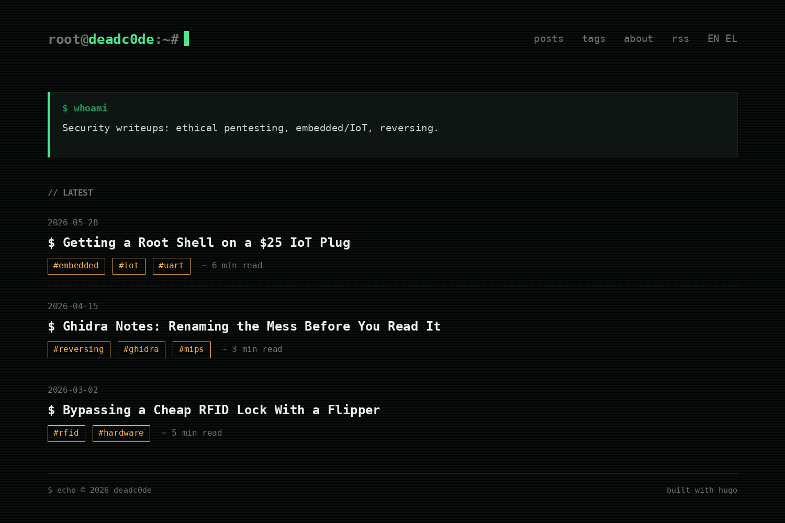

# phosphor

A terminal / CRT-phosphor Hugo theme built for security writeups — ethical
pentesting, embedded/IoT, and reverse engineering. Dark by design, monospace,
and deliberately low on JavaScript.

```
root@deadc0de:~# ▮
```



## Features

- **New template system** (Hugo `v0.146.0+`): `layouts/` root, `_partials/`,
  `_shortcodes/`, `_markup/`, page-kind templates (`home`, `page`, `section`,
  `taxonomy`, `term`).
- All-monospace aesthetic: **Space Mono** (display) + **JetBrains Mono** (body/code).
- Phosphor-green palette with faint CRT scanlines (auto-off for reduced-motion).
- Class-based syntax highlighting themed to match.
- Tags, table of contents, reading time, RSS, pagination, prev/next.
- Copy-to-clipboard buttons on code blocks (the only JS, loaded only when a code
  block is present).
- Render hooks: external links open safely; images are lazy-loaded.
- Asset pipeline: CSS/JS are minified + fingerprinted in production.

## Requirements

- Hugo **extended**, `>= 0.146.0`.

## Quick start

```bash
hugo new site myblog && cd myblog
git init
git submodule add https://github.com/anaskalt/phosphor themes/phosphor
cp themes/phosphor/exampleSite/hugo.toml hugo.toml
hugo new content posts/my-first-writeup.md
hugo server -D
```

Open <http://localhost:1313>.

## Required configuration

The theme styles code via its own CSS palette, so Chroma must emit **classes**:

```toml
[markup.highlight]
  noClasses = false      # REQUIRED
[markup.goldmark.renderer]
  unsafe = true          # allow raw HTML in markdown
```

See `exampleSite/hugo.toml` for the full, commented configuration.

## Theme parameters

```toml
[params]
  author     = "deadc0de"
  promptUser = "root"    # the "root@" in the header
  promptHost = "deadc0de"# the "@deadc0de" in the header
  bio        = "shown in the homepage whoami box"
  # favicon  = "favicon.ico"

  [[params.social]]      # repeated for each footer link
    name = "github"
    url  = "https://github.com/anaskalt"
```

## Writing a writeup

`hugo new content posts/name.md` gives you this front matter + skeleton:

```toml
+++
title = "..."
date = 2026-06-01T10:00:00+02:00
draft = true
kicker = "embedded // hardware"   # small label above the title (optional)
description = "one-line summary, used in lists + meta tags"
tags = ["embedded", "uart"]
toc = true
+++
```

Structure that works for writeups (see the example posts): intro → target/scope
→ recon → vulnerability → exploitation → impact → disclosure/timeline.

Markdown niceties: fenced code blocks with a language tag get highlighted
(` ```c `, ` ```bash `, ` ```python `, ` ```text `); `> blockquotes` render with a
`[!]` marker; `*emphasis*` is amber; inline `code` is phosphor-green; the
`` shortcode embeds terminal recordings.

## License

MIT — see [LICENSE](LICENSE).
